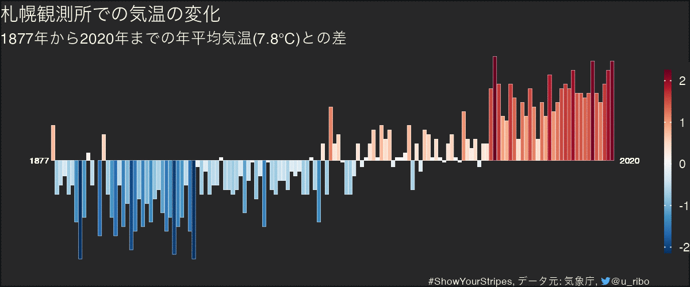
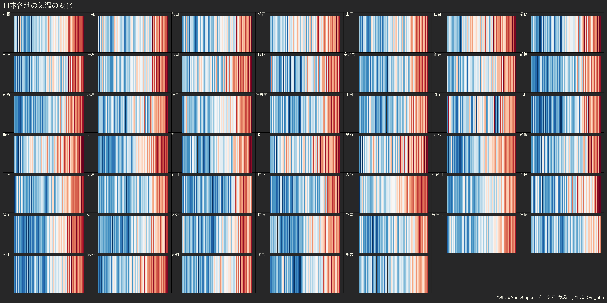

<!-- README.md is generated from README.Rmd. Please edit that file -->

```{r, include = FALSE}
knitr::opts_chunk$set(
  collapse = TRUE,
  comment = "#>"
)
```

# showyourstripes in Japan

Data: [Japan Meteorological Agency](http://www.jma.go.jp/jma/index.html)
Stations: 47 (Representative observatory for the prefecture)
Period: 1876 to 2020

```{r, eval = FALSE, echo = TRUE}
library(dplyr)
library(ggplot2)
library(ggtext)
source("R/plot.R")

targets::tar_load(df_temperature)
```

## Temperature Changes



<details>
<summary>R code</summary>

```{r, echo = TRUE, eval = FALSE}
df_temperature$block_no %>%
  unique() %>%
  purrr::walk(
    function(.x) {
      # png(glue::glue("figures/block_no{.x}.png"),
      #     width = 1200,
      #     height = 550,
      #     res = 320)
      df_temperature %>%
        filter(block_no == .x) %>%
        plot_temperature_changes()
      # dev.off()
      ggsave(glue::glue("figures/block_no{.x}.png"),
             width = 1200,
             height = 500,
             units = "px",
             dpi = 320)
    }
)
```

</details>

## Warming stripes



<details>
<summary>R code</summary>

```{r, eval = FALSE, echo = TRUE}
df_temperature$block_no %>%
  unique() %>%
  purrr::walk(
    function(.x) {
      df_temperature %>%
        filter(block_no == .x) %>%
        filter(!is.na(value), is.na(note)) %>%
        plot_warming_stripes()
      ggsave(glue::glue("figures/stripes_block_no{.x}.png"),
             width = 1200,
             height = 500,
             units = "px",
             dpi = 320)
    }
  )
```

```{r, eval = FALSE, echo = TRUE}
tile_output <- function(block_no) {
  block_no %>%
    purrr::map(
      ~ df_temperature %>%
        filter(block_no == .x) %>%
        .plot_warming_stripes() +
        labs(tag = df_temperature %>%
               filter(block_no == .x) %>%
               pull(station_name) %>%
               .[1])) %>%
    patchwork::wrap_plots() +
    patchwork::plot_layout(ncol = 7) +
    patchwork::plot_annotation(theme = theme(text = element_text(colour = "#FFFFEE",
                                                                 family = "TsukuARdGothic-Regular"),
                                            plot.background = element_rect(fill = "#272728",
                                                                           colour = "transparent"),
                                             panel.border = element_blank()),
                               title = "日本各地の気温の変化",
                               caption = "#ShowYourStripes, データ元: 気象庁, 作成: @u_ribo")
}
tile_output(df_temperature$block_no %>%
              unique())
ggsave(here::here("figures/panel.png"), width = 16, height = 8, dpi = 300)
```

</details>


